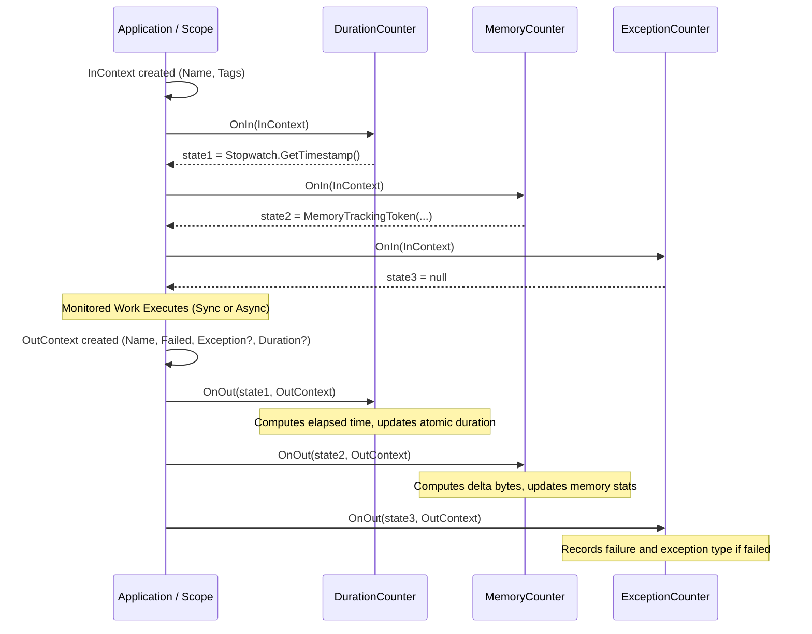

# MetricFlow Architecture

This document describes the design principles, core abstractions, and runtime mechanics of **MetricFlow**.

---

## 1. Architectural Overview & Design Principles

MetricFlow is engineered around three core tenets:
1. **Zero Coupling to Specific Metrics**: The core tracker engine has zero awareness of duration ticks, allocated bytes, or exception hierarchies. Any dimension can be tracked by implementing the generic counter interface.
2. **Lock-Free Hot-Path Execution**: Tracking operations (`In`, `Out`, `Track`) avoid global locks. All aggregations rely on CPU atomic primitives (`Interlocked`), and configuration lookups are eliminated on the hot path via immutable snapshot arrays.
3. **Dynamic Reconfigurability**: Counters can be registered at startup and dynamically enabled/disabled in real time via an observer/notification pattern without process restarts or lock contention.

---

## 2. Component & Flow Architecture

```mermaid
flowchart TD
    subgraph App["Application Code"]
        direction TB
        Call["using (tracker.Track('Checkout'))"]
    end

    subgraph Config["Configuration & Watcher"]
        direction TB
        Src["IOptionsMonitor / Config Provider"]
        Obs["ICounterConfigObservable / Notifier"]
        Src -->|OnChange| Obs
    end

    subgraph Core["MetricFlow Tracker Engine"]
        direction TB
        Tracker["MetricTracker / MetricTrackerBase"]
        ActiveSnapshot["volatile ICounter[] _activeCounters"]
        Scope["CodeTracker (Scope)"]

        Tracker -->|Dispatches to| Scope
        Obs -->|Pushes toggle| Tracker
        Tracker -->|Atomically updates| ActiveSnapshot
    end

    subgraph Counters["Pluggable Counters (Pattern A)"]
        direction TB
        C1["DurationCounter\n(Captures: Stopwatch ticks)"]
        C2["MemoryCounter\n(Captures: Allocated bytes)"]
        C3["ExceptionCounter\n(Captures: Exceptions)"]
        C4["CustomCounter\n(Captures: Arbitrary state)"]
    end

    Call --> Scope
    ActiveSnapshot -.->|Read by| Scope
    Scope -->|OnIn(InContext) -> state| Counters
    Scope -->|OnOut(state, OutContext)| Counters
```

---

## 3. The State-Token Lifecycle Pattern (Pattern A)

Rather than having a monolithic context object with hardcoded measurement fields, MetricFlow uses the **State-Token Pattern**. Each counter is responsible for producing its own state token during operation entry (`OnIn`) and consuming it at operation exit (`OnOut`).



### Universal Context Contracts
- **`InContext`**: Represents operation entry with `MetricName`, `Tags`, and `UtcTimestamp`.
- **`OutContext`**: Represents operation exit with `MetricName`, `Failed`, `Exception?`, `Duration?`, `Tags`, and `UtcTimestamp`.

### The Counter Interface (`ICounter` and `ICounter<TState>`)
```csharp
public interface ICounter
{
    string Name { get; }
    bool IsEnabled { get; set; }

    /// <summary>Invoked when an operation begins. Returns counter-specific state.</summary>
    object? OnIn(in InContext context);

    /// <summary>Invoked when an operation ends, receiving the state produced during OnIn.</summary>
    void OnOut(object? state, in OutContext context);

    /// <summary>Provides the counter's current metric snapshot.</summary>
    IMetricSnapshot? GetSnapshot(string metricName);

    /// <summary>Enumerates snapshots for all tracked metrics.</summary>
    IEnumerable<IMetricSnapshot> GetAllSnapshots();

    /// <summary>Resets accumulated state.</summary>
    void Reset();
}

public interface ICounter<TState> : ICounter
{
    new TState OnIn(in InContext context);
    void OnOut(TState state, in OutContext context);
}
```

---

## 4. Built-in Counters

MetricFlow provides three built-in counters covering standard telemetry dimensions:

| Counter | Metric Dimension | `OnIn` State Token | `OnOut` Behavior | Snapshot Output |
| :--- | :--- | :--- | :--- | :--- |
| **`DurationCounter`** | Execution latency | `long` (Stopwatch ticks) | Calculates elapsed time; updates total, min, max, avg durations and in/out/failed counts atomically. | `DurationSnapshot` |
| **`ExceptionCounter`** | Failures & errors | `null` (0 cost on entry) | Checks `Failed` and `Exception`. Categorizes by exception type in thread-safe dictionary. | `ExceptionSnapshot` |
| **`MemoryCounter`** | Heap allocation | `MemoryTrackingToken` | Computes allocated byte delta. Automatically handles both thread-bound code and cross-thread async hops. | `MemorySnapshot` |

### Async-Safe Memory Tracking
When tracking async methods (`await Task.Yield()`), continuations may resume on different thread pool threads. `MemoryCounter` addresses this by capturing both the thread ID and a process-wide baseline:
- **Same thread (synchronous blocks)**: Computes precise thread-allocated bytes (`GC.GetAllocatedBytesForCurrentThread() - token.ThreadBytes`).
- **Different thread (async hops)**: Seamlessly falls back to process delta (`GC.GetTotalAllocatedBytes(precise: false) - token.TotalBytes`).

---

## 5. Composite Tracker & Execution Scope

`MetricTracker` implements a composite pattern coordinating multiple counters simultaneously:

### 1. Scoped Tracking (`Track`)
The recommended way to track code blocks:
```csharp
using (tracker.Track("ProcessOrder"))
{
    // Executes monitored workload
}
```
* Instantiates a lightweight `CodeTracker` scope.
* Iterates active counters to collect state tokens.
* On disposal, dispatches `OnOut` with final duration, tags, and failure states.

### 2. Decoupled Tracking (`In` / `Out`)
For architectures where operation start and completion occur in different methods or message callbacks:
```csharp
tracker.In("AsyncJob");
// ... Later ...
tracker.Out("AsyncJob", failed: false);
```
* Correlates in-flight operations across async contexts using `AsyncLocal<Dictionary<string, Stack<InOperationState>>>`.

---

## 6. Real-Time Configuration & The Observable Pattern

MetricFlow allows enabling and disabling counters dynamically without application restarts:

```
[Configuration Source: appsettings.json / Consul / Redis / Feature Flags]
                           │
                           ▼
              [ICounterConfigObservable]
              (e.g., CounterConfigNotifier)
                           │
                           ▼ (Push notification: counterName, enabled)
                  [MetricTrackerBase]
                           │
               Rebuilds active array:
             _activeCounters = [c1, c2];
                           │
                           ▼
         Hot-Path: iterates _activeCounters only (Zero lookups)
```

### Hot-Path Optimization (Immutable Snapshot Array)
- The tracker maintains a `volatile ICounter[] _activeCounters` array.
- When configuration changes, the array is rebuilt in the background and swapped atomically.
- **On the hot path**, the tracker reads the local reference to `_activeCounters`. No locks, dictionaries, or string lookups are performed during `Track()` or `In()`. Disabled counters incur zero dispatch overhead.

---

## 7. Concurrency & Thread-Safety Model

MetricFlow guarantees complete thread safety across all layers:

1. **Per-Operation Isolation**:
   - Each `CodeTracker` scope maintains its own isolated state array `object?[] _states`. No cross-request or cross-thread data sharing occurs within a scope.
2. **Lock-Free Aggregation**:
   - `DurationCounter` and `MemoryCounter` use 64-bit atomic operations (`Interlocked.Add`, `Interlocked.Increment`, `Interlocked.Read`, and `CompareExchange` CAS loops for min/max).
   - `ExceptionCounter` uses `ConcurrentDictionary<string, long>` for thread-safe breakdown categorization.
3. **Atomic Disposal Guard**:
   - Scope completion is protected by `Interlocked.Exchange(ref _disposed, 1)`, guaranteeing strictly one-time execution even under concurrent `Dispose()` invocations.

---

## 8. Creating a Custom Counter

To create a new custom counter, implement `ICounter` (or derive from the strongly-typed `CounterBase<TState>` / untyped `CounterBase`):

```csharp
using DotnetKit.MetricFlow.Tracker.Abstractions;

public class ThreadPoolQueueCounter : CounterBase<long>
{
    public ThreadPoolQueueCounter() : base("ThreadPoolQueue") { }

    public override long OnIn(in InContext context)
    {
        if (!IsEnabled) return 0;
        // Capture initial pending work items
        return ThreadPool.PendingWorkItemCount;
    }

    public override void OnOut(long startQueue, in OutContext context)
    {
        if (!IsEnabled || startQueue == 0) return;

        var delta = ThreadPool.PendingWorkItemCount - startQueue;
        // Atomically record delta into custom state...
    }

    public override IMetricSnapshot? GetSnapshot(string metricName) => ...;
    public override IEnumerable<IMetricSnapshot> GetAllSnapshots() => ...;
    public override void Reset() => ...;
}
```

### Registration:
```csharp
var tracker = new MetricTracker("AppTopic");
tracker.RegisterCounter(new ThreadPoolQueueCounter());
```
When `tracker.Track("MyOperation")` executes, `ThreadPoolQueueCounter` is automatically invoked alongside `DurationCounter`, `MemoryCounter`, and `ExceptionCounter`.
