# MetricFlow Roadmap

This document outlines the development roadmap and planned improvements for **MetricFlow**. It tracks short-term bug fixes, mid-term developer experience enhancements, and long-term cloud-native observability capabilities.

---

## 🎯 Vision & Goals

MetricFlow aims to be a lightweight, high-performance, and thread-safe .NET library for tracking domain and functional metrics (latencies, operation counts, throughput, error rates) with minimal allocation overhead and seamless integration into modern .NET and cloud-native observability stacks.

---

## 📊 Roadmap Overview

```mermaid
flowchart LR
    subgraph Phase1["Phase 1: v1.1.0 — Stabilization & Core Fixes"]
        direction TB
        P1_1["Fix failing unit test on failed metrics"]
        P1_2["Resolve 10,000x duration calculation bug"]
        P1_3["Thread-safe timing (Stopwatch.GetTimestamp)"]
        P1_4["Refactor sampling logic & Random.Shared"]
        P1_5["Accurate average duration calculation"]
        P1_6["Repository & project structure cleanup"]
    end

    subgraph Phase2["Phase 2: v1.2.0 — High Performance & ASP.NET Core"]
        direction TB
        P2_1["Zero-allocation MetricScope struct"]
        P2_2["DotnetKit.MetricFlow.AspNetCore package"]
        P2_3["Histogram & percentiles (P50, P90, P99)"]
        P2_4["TagList & zero-alloc metadata support"]
        P2_5["BenchmarkDotNet performance suite"]
    end

    subgraph Phase3["Phase 3: v2.0.0 — Cloud-Native & Observability"]
        direction TB
        P3_1["OpenTelemetry (System.Diagnostics.Metrics)"]
        P3_2["Native Prometheus text exporter"]
        P3_3["DotnetKit.MetricFlow.Collector push sinks"]
        P3_4["Multi-target net8.0, net9.0, netstandard2.1"]
    end

    Phase1 --> Phase2 --> Phase3
```



---

## 🚀 Phases & Milestones

### Phase 1: v1.1.0 — Stabilization & Core Correctness (Immediate / Q1)

Focus on resolving critical bugs, thread safety flaws, duration miscalculations, and establishing a robust CI/CD baseline.

| Area | Task | Priority | Status |
| :--- | :--- | :---: | :---: |
| **Testing** | Fix failing assertion in `MetricTracker_ShouldTrackFailedMetrics` (`InCount` was called twice, asserted 1). | 🔴 High | ✅ Completed |
| **Correctness** | Fix duration conversion: `StopWatchCounter.Stop()` returns ticks, which were incorrectly treated as milliseconds in `TimeSpan.FromMilliseconds`, inflating measurements by 10,000×. | 🔴 High | ✅ Completed |
| **Concurrency** | Replace shared mutable `Stopwatch` instance in `StopWatchCounter` with `Stopwatch.GetTimestamp()` and per-operation elapsed time calculation to prevent concurrent requests from clobbering each other's timers. | 🔴 High | ✅ Completed |
| **Sampling** | Fix `IsSampled` in `MetricTrackerBase`: ensure `null` sampling rate tracks all metrics, make sampling decision consistent between `In()` and `Out()` (prevent count mismatch), and replace `Random` with thread-safe `Random.Shared`. | 🔴 High | ✅ Completed |
| **Math** | Fix `UpdateAverageDuration`: replace binary average `(initialValue + duration) / 2` with true cumulative average (`totalDuration / outCount`) or configurable Exponential Moving Average (EMA). | 🟡 Medium | ✅ Completed |
| **Clean-up** | Clean up incomplete or orphaned directories: flesh out or remove empty `src/DotnetKit.MetricFlow.Core` and `src/DotnetKit.MetricFlow.Collector`; resolve unreferenced `examples/CustomCounters/`. | 🟡 Medium | ✅ Completed |
| **CI/CD** | Add Pull Request workflow running `dotnet test` on all branches; upgrade GitHub actions to modern versions (`actions/checkout@v4`, `actions/setup-dotnet@v4`). | 🟡 Medium | ✅ Completed |

---

### Phase 2: v1.2.0 — High Performance & ASP.NET Core (Short–Medium Term / Q2)

Focus on zero-allocation tracking, web framework integration, and tail-latency observability.

| Area | Task | Priority | Status |
| :--- | :--- | :---: | :---: |
| **Allocations** | Implement zero-allocation `MetricScope` (ref struct or lightweight disposable struct) for `using (tracker.Track(...))` to eliminate heap allocation per tracked block. | 🔴 High | Planned |
| **ASP.NET Core** | Create `DotnetKit.MetricFlow.AspNetCore` NuGet package with turnkey middleware, endpoint routing filters (`AddEndpointFilter`), and automatic HTTP request tracking (status codes, routes, exceptions). | 🔴 High | ✅ Completed |
| **Histograms** | Introduce histogram and percentile metrics (P50, P75, P90, P99, P99.9) using HDR histogram or exponential bucket reservoirs to capture tail latency. | 🟡 Medium | Planned |
| **Performance** | Optimize `ConcurrentDictionary.GetOrAdd` calls in `MetricTrackerBase` to use factory lambdas rather than evaluating factory delegates eagerly on existing keys. | 🟡 Medium | Planned |
| **Tags** | Support `System.Diagnostics.TagList` and `ReadOnlySpan<KeyValuePair<string, object>>` to avoid dictionary allocations on hot-path tracking calls. | 🟡 Medium | Planned |
| **Benchmarking** | Add `benchmarks/MetricFlow.Benchmarks` project using **BenchmarkDotNet** to track operations/sec, memory allocations, and lock contention under high concurrency. | 🟢 Low | Planned |

---

### Phase 3: v2.0.0 — Cloud-Native & Open Observability (Long Term / Q3–Q4)

Focus on standard observability ecosystems (OpenTelemetry, Prometheus, Grafana), push pipelines, and broad compatibility.

| Area | Task | Priority | Status |
| :--- | :--- | :---: | :---: |
| **OpenTelemetry** | Bridge MetricFlow to .NET's built-in `System.Diagnostics.Metrics` (`Meter`, `Counter<T>`, `Histogram<T>`). Allows seamless export to OpenTelemetry collectors, Azure Monitor, Datadog, and AWS CloudWatch without custom plugins. | 🔴 High | Planned |
| **Prometheus** | Add direct Prometheus text exposition endpoint (`/metrics`) adhering to the OpenMetrics / Prometheus standard format. | 🟡 Medium | Planned |
| **Collector** | Implement `DotnetKit.MetricFlow.Collector` as a background hosted service (`IHostedService`) that buffers, aggregates, and periodically flushes metrics to remote storage (OTLP, InfluxDB, Kafka, or HTTP/gRPC sinks). | 🟡 Medium | Planned |
| **Multi-Targeting** | Expand target frameworks to include `net8.0`, `net9.0`, and `netstandard2.1` for maximum cross-platform and library ecosystem compatibility. | 🟢 Low | Planned |
| **Resilience** | Add circuit breaker / drop-on-backpressure policies to prevent metrics collection from impacting application performance during saturation. | 🟢 Low | Planned |

---

## 📈 Impact vs. Effort Matrix

```
   HIGH IMPACT
        ▲
        │  [Fix Duration 10,000x]      [AspNetCore Package]
        │  [Thread-Safe Timing]        [OpenTelemetry Bridge]
        │  [Fix Failing Tests]         [Percentiles / Histograms]
        │  [Fix Sampling & Random]     [Zero-Alloc MetricScope]
        │
        │  [Clean Empty Dirs]          [Collector Push Pipeline]
        │  [GitHub Actions Update]     [Multi-Targeting]
        │  [BenchmarkDotNet Suite]
        ▼
   LOW IMPACT ──────────────────────────────────────────► HIGH EFFORT
            LOW EFFORT
```

---

## 🤝 Contributing

Suggestions, feedback, and pull requests for any items on this roadmap are welcome! Please open an issue to discuss proposed designs before submitting large PRs.
