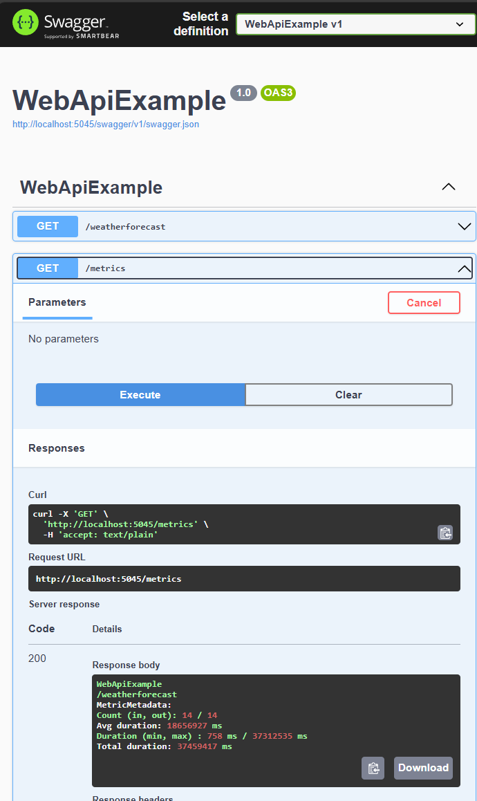

# Web API Example with MetricFlow

This example demonstrates how to use the `MetricFlow` library to track and measure metrics in a .NET Web API application. The example includes a `Program` class that sets up the web application, configures middleware to track API calls, and exposes metrics via an endpoint.

## Goal

The goal of this example is to showcase how to integrate `MetricFlow` into a .NET Web API application to track various metrics such as request counts and durations for different API endpoints and indicate failed request count.

This helps in monitoring the performance and usage of the API.

## Overview of Implementation

### Key Components

- **MetricTracker:** Tracks metrics for different API endpoints.
- **Middleware:** Automatically tracks metrics for incoming requests.
- **Endpoints:** Demonstrates how to track metrics for specific API endpoints and expose metrics.

### Implementation Details

1. **Service Registration:**
   - The `MetricTracker` service is registered as a global service in the dependency injection container.

    ```csharp
    builder.Services.AddSingleton<MetricTracker>(sp => new MetricTracker("WebApiExample"));
    ```

2. **Middleware Configuration:**
   - Middleware is added to track metrics for incoming requests, excluding the `/metrics` endpoint.
   - This oveview doesn't track failed requests, please look source code of this example for complete implementation.

    ```csharp
    app.Use(async (context, next) =>
    {
        if (context.Request.Path != "/metrics")
        {
            var tracker = context.RequestServices.GetRequiredService<MetricTracker>();
            tracker.In(context.Request.Path);
            await next();
            tracker.Out(context.Request.Path);
        }
        else
        {
            await next();
        }
    });
    ```

3. **Endpoints:**
   - The `/weatherforecast` endpoint simulates a weather forecast API and tracks metrics for the endpoint.
   - The `/metrics` endpoint exposes the tracked metrics.

    ```csharp
    app.MapGet("/weatherforecast", (MetricTracker tracker) =>
    {
        tracker.In("GetWeatherForecast");
        var forecast = Enumerable.Range(1, 5).Select(index =>
            new WeatherForecast
            (
                DateOnly.FromDateTime(DateTime.Now.AddDays(index)),
                Random.Shared.Next(-20, 55),
                summaries[Random.Shared.Next(summaries.Length)]
            ))
            .ToArray();
        tracker.Out("GetWeatherForecast");
        return forecast;
    })
    .WithName("GetWeatherForecast")
    .WithOpenApi();

    app.MapGet("/metrics", (MetricTracker tracker) =>
    {
        return tracker.ToString();
    })
    .WithName("Metrics")
    .WithOpenApi();
    ```

### Code Example

```csharp
using System.Diagnostics;
using DotnetKit.MetricFlow.Tracker;
using DotnetKit.MetricFlow.Tracker.Abstractions;

var builder = WebApplication.CreateBuilder(args);

// Add services to the container.
builder.Services.AddEndpointsApiExplorer();
builder.Services.AddSwaggerGen();
builder.Services.AddSinglton<MetricTracker>(sp => new MetricTracker("WebApiExample"));

var app = builder.Build();

// Configure the HTTP request pipeline.
if (app.Environment.IsDevelopment())
{
    app.UseSwagger();
    app.UseSwaggerUI();
}

app.UseHttpsRedirection();

app.Use(async (context, next) =>
{
    if (context.Request.Path != "/metrics")
    {
        var tracker = context.RequestServices.GetRequiredService<MetricTracker>();
        tracker.In(context.Request.Path);
        await next();
        tracker.Out(context.Request.Path);
    }
    else
    {
        await next();
    }
});

var summaries = new[]
{
    "Freezing", "Bracing", "Chilly", "Cool", "Mild", "Warm", "Balmy", "Hot", "Sweltering", "Scorching"
};

app.MapGet("/weatherforecast", (MetricTracker tracker) =>
{
    tracker.In("GetWeatherForecast");
    var forecast = Enumerable.Range(1, 5).Select(index =>
        new WeatherForecast
        (
            DateOnly.FromDateTime(DateTime.Now.AddDays(index)),
            Random.Shared.Next(-20, 55),
            summaries[Random.Shared.Next(summaries.Length)]
        ))
        .ToArray();
    tracker.Out("GetWeatherForecast");
    return forecast;
})
.WithName("GetWeatherForecast")
.WithOpenApi();

app.MapGet("/metrics", (MetricTracker tracker) =>
{
    return tracker.ToString();
})
.WithName("Metrics")
.WithOpenApi();

app.Run();

record WeatherForecast(DateOnly Date, int TemperatureC, string? Summary)
{
    public int TemperatureF => 32 + (int)(TemperatureC / 0.5556);
}
```


