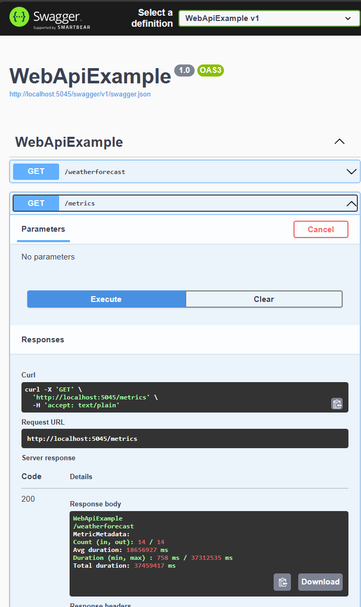

# Web API Example with MetricFlow

This example demonstrates how to use the `MetricFlow` library to track and measure metrics in a .NET Web API application. The example showcases turnkey ASP.NET Core middleware, multi-topic tracker registration, the top-level `IMetricFlow` facade, native keyed DI injection, and metrics exposition via an endpoint.

## Goal

The goal of this example is to showcase how to integrate `MetricFlow` into a .NET Web API application to:
- Track HTTP request rate, durations, status codes, and exceptions automatically via middleware.
- Manage multiple metric topics within the same application (e.g., `WebApiExample` and `WeatherRadar`).
- Leverage flexible Dependency Injection patterns (fluent builder, top-level facade, keyed injection, and default injection).
- Expose aggregated metrics for Prometheus or monitoring collectors.

---

## Overview of Implementation

### Key Components

- **`IMetricFlow` (Top-Level Facade):** Central registry and manager to resolve trackers by topic name at runtime, access the default tracker, or enumerate all active trackers.
- **`IMetricFlowBuilder` (Fluent Builder):** Builder based on `IFluentBuilder<IServiceCollection>` enabling clean, chained registration of multiple metric topics.
- **`IMetricTracker` / `MetricTracker`:** The core tracker instance for monitoring operations, scopes, and counter dimensions.
- **`UseMetricFlow()` (Middleware):** Turnkey ASP.NET Core middleware that records request latency, HTTP status codes, route patterns, and custom header enrichments.
- **`MapMetricFlow("/metrics")` (Endpoint):** Exposes formatted plain-text metric snapshots across all active trackers.

---

## Dependency Injection Capabilities

MetricFlow offers a comprehensive suite of DI patterns designed for modern .NET (8+ / 10+):

### 1. Fluent Builder Registration (`IMetricFlowBuilder`)
Using the fluent builder pattern based on `IFluentBuilder<IServiceCollection>`, you can configure the primary application tracker and chain additional topic trackers in one readable block:

```csharp
builder.Services.AddMetricFlow("WebApiExample", options =>
{
    // Custom tag enrichment from request headers
    options.EnrichTags = (tags, context) =>
    {
        if (context.Request.Headers.TryGetValue("X-Tenant-ID", out var tenantId))
        {
            tags["tenant_id"] = tenantId!;
        }
    };
})
.AddMetricTracker("WeatherRadar", options =>
{
    options.SamplingRate = 1.0;
});
```

Because `IMetricFlowBuilder` implements `IFluentBuilder<IServiceCollection>`, you can access the underlying service collection via `builder.Current` or `builder.Services`, or continue chaining standard `IServiceCollection` extension methods directly.

---

### 2. Standalone & Modular Tracker Registration (`AddMetricFlowTracker`)
For modular architectures, feature plugins, or separate service modules, you can register individual topic trackers independently without reconfiguring the root engine:

```csharp
// Register core engine & facade
builder.Services.AddMetricFlow();

// Register specific topic trackers across different modules
builder.Services.AddMetricFlowTracker("WeatherRadar", options =>
{
    options.TopicTags = new Dictionary<string, string> { ["sensor"] = "doppler" };
});

builder.Services.AddMetricFlowTracker("WeatherAlerts", options =>
{
    options.SamplingRate = 1.0;
});
```

---

### 3. Top-Level Facade Resolution (`IMetricFlow`)
Inject `IMetricFlow` when a component needs to retrieve trackers by topic name dynamically or inspect application-wide metrics:

```csharp
app.MapGet("/radar/scan", (IMetricFlow metricFlow) =>
{
    // Retrieve tracker by topic name
    var tracker = metricFlow.GetTracker("WeatherRadar");
    using var operation = tracker.Track("ScanRadar");

    return Results.Ok(new { message = "Radar scan tracked", topic = tracker.Topic });
});
```

#### Facade Features:
* **`metricFlow.GetTracker(topic)`**: Gets the tracker for the topic. If the topic was not pre-registered in DI, it automatically creates and caches a new tracker instance with default options.
* **Indexer syntax**: `metricFlow["WeatherRadar"]`.
* **`metricFlow.TryGetTracker(topic, out var tracker)`**: Tests if a tracker already exists without creating one.
* **`metricFlow.DefaultTracker`**: Accesses the primary default application tracker.
* **`metricFlow.Trackers`**: Enumerates all active trackers (used by `/metrics` to aggregate all snapshots).

---

### 4. Native Keyed Injection (.NET 8+)
Every registered topic tracker is automatically registered as a Keyed Service (`[FromKeyedServices(topic)]`). This allows consumers to declare their specific tracker directly in constructors or minimal API handlers:

```csharp
public class WeatherRadarWorker([FromKeyedServices("WeatherRadar")] IMetricTracker tracker)
{
    public void Process()
    {
        using var scope = tracker.Track("ProcessDopplerScan");
        // ...
    }
}
```

Or in Minimal APIs:
```csharp
app.MapGet("/radar-health", ([FromKeyedServices("WeatherRadar")] IMetricTracker tracker) =>
{
    return Results.Ok(new { topic = tracker.Topic });
});
```

---

### 5. Default Un-Keyed Tracker (`IMetricTracker`)
For standard endpoints and single-topic components, injecting `IMetricTracker` automatically resolves the primary default tracker (the first registered topic, or the one configured via `AddMetricFlow`):

```csharp
app.MapGet("/weatherforecast", (IMetricTracker tracker) =>
{
    using var scope = tracker.Track("QueryWeather");
    return forecast;
});
```

---

## Tag Management

MetricFlow provides a flexible tagging model that allows you to attach context to metrics at three distinct levels, from application-wide static tags down to individual operation scopes.

### The 3 Levels of Tags

| Tag Level | Where Defined | Scope | Example |
| :--- | :--- | :--- | :--- |
| **1. Topic Tags** | `options.TopicTags` | Global (entire tracker) | `options.TopicTags = new() { ["env"] = "Production", ["region"] = "us-east" };` |
| **2. Middleware Enriched Tags** | `options.EnrichTags`<br>`IncludeHttpMethod`<br>`IncludeStatusCode` | All HTTP requests in the pipeline | `options.EnrichTags = (tags, ctx) => tags["tenant_id"] = ...;` |
| **3. Operation / Scope Tags** | Direct at call-site (`tracker.Track(...)` or `scope.SetTag(...)`) | Individual operation execution | `tracker.Track("GetWeather", new() { ["country"] = country });` |

All tags—whether defined in options, enriched by middleware, or passed dynamically at the call-site—flow through `InContext` and `OutContext` to all active counters.

---

### How Tags Appear in Metric Snapshots

To prevent high-cardinality memory leaks from unbounded tag values, MetricFlow handles snapshot visualization intentionally:

1. **Topic Tags (`options.TopicTags`):**
   Rendered automatically in the global snapshot header:
   ```text
   WebApiExample
   Topic Tags:
     - env: Production
     - region: us-east
   ```

2. **Operation / Dynamic Tags (from `EnrichTags` or `tracker.Track(tags)`):**
   Standard performance counters (such as `DurationCounter`, `ThroughputCounter`, `ExceptionCounter`, and `MemoryCounter`) aggregate technical measurements across operations.
   
   To surface and break down operations by any specific tag (e.g. `tenant_id` from middleware or `country` from an endpoint), register a **`DimensionCounter`** / **`TagBreakdownCounter`**:

   ```csharp
   builder.Services.AddMetricFlow("WebApiExample", options =>
   {
       // 1. Enrich tags from HTTP headers in middleware
       options.EnrichTags = (tags, context) =>
       {
           if (context.Request.Headers.TryGetValue("X-Tenant-ID", out var tenantId))
           {
               tags["tenant_id"] = tenantId!;
           }
       };

       // 2. Break down snapshots by tenant_id (from middleware)
       options.AddTagBreakdownCounter("tenant_id");

       // 3. Break down snapshots by country (from endpoint tracker.Track)
       options.AddDimensionCounter("country");
   });
   ```

   When queried (e.g. via `/metrics`), the output automatically includes the dimensional breakdown:

   ```text
   [TagBreakdown:tenant_id] Metric: /weatherforecast
   Total Operations       : 10
   Tagged Operations      : 8 (80.0%)
   Breakdown by 'tenant_id':
     - tenant_alpha: 5 (62.5%)
     - tenant_beta : 3 (37.5%)

   [Dimension:country] Metric: QueryedByCountryWheather
   Total Operations       : 5
   Tagged Operations      : 4 (80.0%)
   Breakdown by 'country':
     - US: 3 (75.0%)
     - DE: 1 (25.0%)
   ```

> **Cardinality Safeguard:** `DimensionCounter` includes built-in cardinality protection (defaulting to 250 max unique values) with automatic rollup into `[Other]` to safeguard against unbounded memory growth.

---

## Middleware & Endpoint Configuration

### Turnkey Tracking Middleware
Enable automatic tracking of HTTP request rate, duration, and failures with one line:

```csharp
app.UseMetricFlow();
```

### Metrics Exposition Endpoint
Map the `/metrics` endpoint to expose plain-text metric snapshots across all active topics:

```csharp
app.MapMetricFlow("/metrics");
```

---

## Complete Code Example (`Program.cs`)

```csharp
using DotnetKit.MetricFlow.Abstractions;
using DotnetKit.MetricFlow.AspNetCore.Extensions;

var builder = WebApplication.CreateBuilder(args);

// Add services to the container.
builder.Services.AddEndpointsApiExplorer();
builder.Services.AddSwaggerGen();

// Register MetricFlow with custom tag enrichment and additional topic tracker via fluent builder
builder.Services.AddMetricFlow("WebApiExample", options =>
{
    options.EnrichTags = (tags, context) =>
    {
        if (context.Request.Headers.TryGetValue("X-Tenant-ID", out var tenantId))
        {
            tags["tenant_id"] = tenantId!;
        }
    };
})
.AddMetricTracker("WeatherRadar");

var app = builder.Build();

// Configure the HTTP request pipeline.
if (app.Environment.IsDevelopment())
{
    app.UseSwagger();
    app.UseSwaggerUI();
}

app.UseHttpsRedirection();

// Turnkey MetricFlow tracking middleware
app.UseMetricFlow();

var summaries = new[]
{
    "Freezing", "Bracing", "Chilly", "Cool", "Mild", "Warm", "Balmy", "Hot", "Sweltering", "Scorching"
};

// 1. Default IMetricTracker injection
app.MapGet("/weatherforecast", (IMetricTracker tracker, string? country = null) =>
{
    using var scope = !string.IsNullOrWhiteSpace(country)
        ? tracker.Track("QueryedByCountryWheather", new Dictionary<string, string> { { "country", country } })
        : null;

    var forecast = Enumerable.Range(1, 5).Select(index =>
        new WeatherForecast
        (
            DateOnly.FromDateTime(DateTime.Now.AddDays(index)),
            Random.Shared.Next(-20, 55),
            summaries[Random.Shared.Next(summaries.Length)],
            country
        ))
        .ToArray();
    return forecast;
})
.WithName("GetWeatherForecast")
.WithOpenApi();

app.MapGet("/throw_exception", () =>
{
    throw new Exception("This is an exception");
})
.WithName("Exception")
.WithOpenApi();

// 2. Top-level IMetricFlow facade injection (multi-topic resolution)
app.MapGet("/radar/scan", (IMetricFlow metricFlow) =>
{
    var tracker = metricFlow.GetTracker("WeatherRadar");
    using var operation = tracker.Track("ScanRadar");
    return Results.Ok(new { message = "Radar scan tracked", topic = tracker.Topic });
})
.WithName("ScanRadar")
.WithOpenApi();

// 3. Expose metrics endpoint
app.MapMetricFlow("/metrics")
.WithOpenApi();

app.Run();

record WeatherForecast(DateOnly Date, int TemperatureC, string? Summary, string? Country = null)
{
    public int TemperatureF => 32 + (int)(TemperatureC / 0.5556);
}
```


